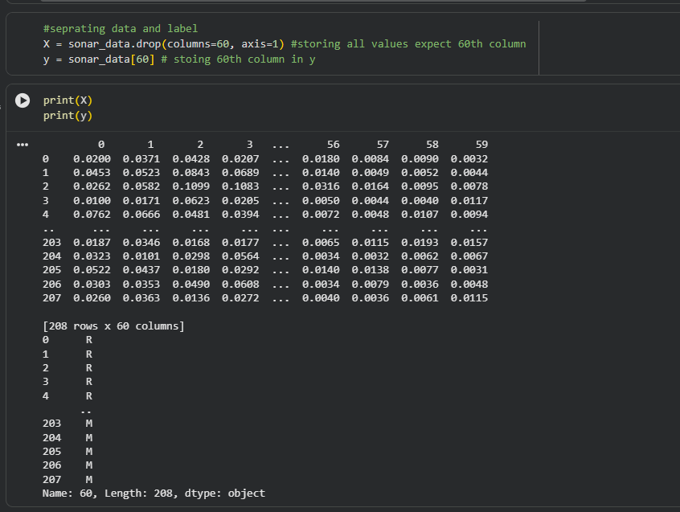
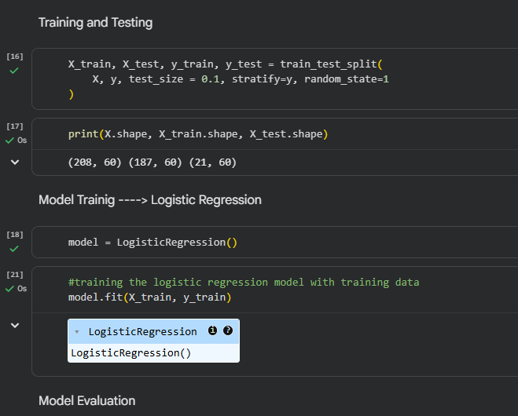
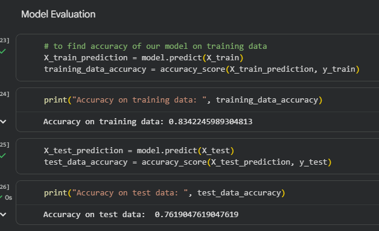
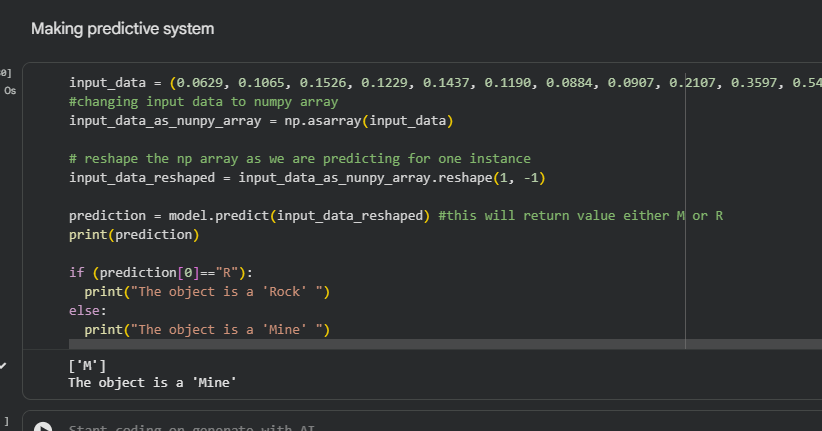

# Sonar Rock vs Mine Prediction

A Machine Learning project that predicts whether an underwater object is a **Rock (R)** or a **Mine (M)** using Sonar signal data and Logistic Regression.

## Project Overview

This project uses a Logistic Regression model to classify sonar signals reflected from underwater objects. The model is trained on the Sonar Dataset and can predict whether the detected object is a rock or a mine.

## Dataset Information

- Dataset: Sonar Dataset
- Total Samples: 208
- Features: 60
- Classes:
  - R → Rock
  - M → Mine

## Technologies Used

- Python
- NumPy
- Pandas
- Scikit-Learn
- Google Colab

## Machine Learning Workflow

1. Data Collection
2. Data Preprocessing
3. Feature and Label Separation
4. Train-Test Split
5. Logistic Regression Training
6. Model Evaluation
7. Prediction System

---

## Project Screenshots

### 1. Data Preparation

Separating features (X) and labels (Y) from the dataset.



---

### 2. Train-Test Split

Splitting the dataset into training and testing sets and initializing the Logistic Regression model.



---

### 3. Model Evaluation

Evaluating model performance on training and testing data.

**Results:**
- Training Accuracy: **83.42%**
- Testing Accuracy: **76.19%**



---

### 4. Prediction System

Making predictions on new sonar signal data.

Prediction Result:

```text
The object is a Mine
```



---

## Model Used

### Logistic Regression

Logistic Regression is a supervised machine learning algorithm used for binary classification problems. Since the target variable contains only two classes (Rock and Mine), Logistic Regression is an effective choice for this project.

## How to Run

### Clone Repository

```bash
git clone https://github.com/pranavm107/Sonar-Rock-vs-Mine-Prediction.git
```

### Install Dependencies

```bash
pip install numpy pandas scikit-learn
```

### Run the Project

```bash
python rock_vs_mine_prediction.py
```

## Project Structure

```text
Sonar-Rock-vs-Mine-Prediction/
│
├── sonar_prediction.ipynb
├── sonar_prediction.py
├── sonar_data.csv
├── README.md
│
└── images/
    ├── 01-data-preparation.png
    ├── 02-train-test-split.png
    ├── 03-model-training.png
    ├── 04-model-evaluation.png
    └── 05-prediction-system.png
```

## Learning Outcomes

- Data Preprocessing
- Feature Selection
- Binary Classification
- Logistic Regression
- Train-Test Split
- Model Evaluation
- Prediction Systems

## Author

**Pranav Agneesh**

Day 1 of **#30Days30MLProjects**
